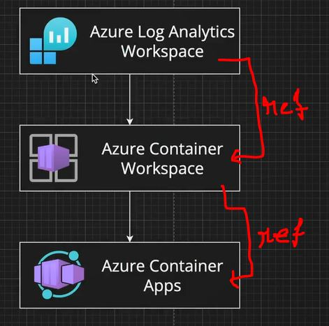
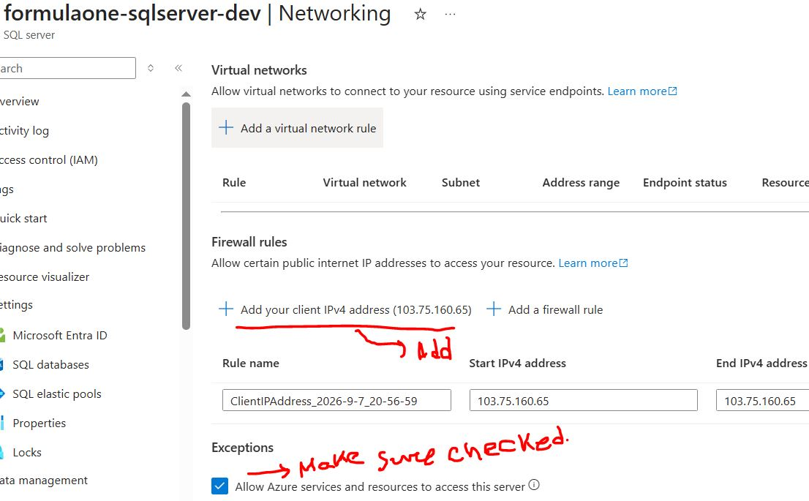

1. After creating 01vars.tf,02setup.tf and 03resource_group.tf,
   and inside iac/ , run `terraform init` so that it executes on azure.

2. `.terraform.lock.hcl` tracks every changes and compare it with remote changes (changes are previously made inside cloud providers).

3. `terraform plan` is basically like a test run. It compares the changes.

4. After running the command  `terraform apply` ,  it will create a file named `terraform.tfstate`.

5. Then I have created `04azure_container_registry.tf`

6. Now before create `azure container app` , check the image

So , `Azure Container Apps` require `Azure Container Workspace` first to be created . `Azure Container Workspace` require `Azure Log Analytics Workspace` to be created.

> Azure Container Registry (ACR) is where you store container images, while Azure Container Apps (ACA) is where you run them.

7. After creating azure sql server and sql db from terraform , check this , and make sure to add ip address like this

-------------

## Creating CI-CD pipeline using Github action

1- Create a folder named `.github`.
2- Create a folder named workflows under `.github` folder

